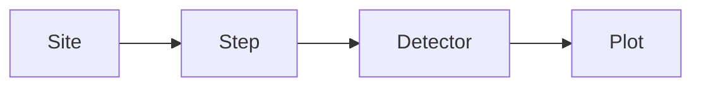

Releases on GitHub: [ASV Project Explorer](https://github.com/ChrisLeeThompson/ASV_Project_Explorer/releases)

Latest version: 

## Introduction

[Auto Slice and View (ASV)](https://www.thermofisher.com/us/en/home/electron-microscopy/products/software-em-3d-vis/auto-slice-view-4-software.html) is a Thermo Fisher Scientific (TFS) software application that is used to perform automated focused ion beam (FIB) serial sectioning.

ASV Project Explorer is a Python UI that parses, processes, and displays information from Auto Slice and View project files. The UI includes plots of common metadata vs. slice index, searchable image metadata, a full-resolution image viewer, live updates from an active ASV project directory, and a single image metadata reader.

The project data can be helpful for tracking a project's progress, analyzing data quality, and troubleshooting ASV project issues.

## Requirements

The script's requirements differ from the standard list under [Requirements](/scripts/#requirements) on the [Scripts](/scripts/) page. The script requires:

* PySide6 6.7.1+
* Python 3.11+
* Matplotlib 3.8.1+
* NumPy 2.2.5+
* tifffile 2025.3.13+

AutoScript is not required to run this script, but all of these packages are included with the AutoScript 4.14 environment, so no additional dependencies are needed if the script is run with AutoScript.

The script was tested with ASV 5.13.

## Installation

To install, follow the general steps under [Installing A Script](/scripts/#installing-a-script) on the [Scripts](/scripts/) page. The script does not connect to a microscope, so it can be installed on any compatible PC.

## Running the Script

The script's main file is `asv_project_explorer.py`. See [Running A Script](/scripts/#running-a-script) on the [Scripts](/scripts/) page for how to run it with the AutoScript Python interpreter or the AutoScript Runner application.

## The Two Tabs



The ASV Project Explorer application window has two main tabs: the ASV Project Metadata tab and the Single Image Metadata tab.

The ASV Project Metadata tab contains the bulk of the application, and it is where an ASV project directory is loaded and explored. Most of the following sections are dedicated to this tab.

The ASV Project Metadata tab has two subtabs. They are the Plots tab and the Project Parameters tab. The Plots tab is where the metadata vs. slice index plots can be displayed. The Project Parameters tab shows the parameters that were used in the project.

The [Single Image Metadata](#single-image-metadata) tab has a simple UI to view and search the metadata in a single image (`.tif` or `.png`).

## Loading an ASV Project



In this context, an ASV project is an entire ASV project directory. Note the script can parse either Cross-section or Spin Mill projects.

There are two methods for loading a project. One is to click the Load ASV Project button and select the project directory from the Select ASV Project Directory window. The other method is to drag and drop a project directory onto Catbug (the icon in the upper-right corner of the application window).

The script validates the project directory by checking that the `ExecutionHistory.json`, `Metadata.json`, and `Project.AsvProject` files are present.

When a project is loaded, the script parses the project files. The parsed data is written to a `_temp_consolidated_metadata.json` file, which is saved in a new `_temp_output_JSON_file` directory in the project root directory.

The `_temp_consolidated_metadata.json` file can be loaded by clicking the Load Metadata File button or dragging and dropping the file onto Catbug. Loading a project from the `.json` file is much faster than loading the project directory because the data is already parsed.

If you load the `.json` file without the project directory, project images may not be available in the UI as only their relative paths are saved in the file.



## Plot Selection Controls


    
        
    
    
        
    


After a project is loaded, several panels are arranged vertically on the right side of the Plots tab. The Plot Selection panel is the main entry point for exploring the data.

The Plot Selection panel contains four comboboxes and three buttons. The Display button displays the currently selected plot(s), the Clear button removes all displayed plots, and the Export Plots button exports all displayed plots. 

The export includes a `.csv`, `.png`, and `.svg` file for each displayed plot. In addition, a `.csv` file containing the Step's Execution History is exported. This can be helpful when exploring the plot data and auto functions performed for each slice.

The plot selection comboboxes follow the ASV project data hierarchy:

In this example project, there is one site, "Life Science - Cryo", and one step, "SEM Imaging". Two sets of images were acquired with different detector settings. Therefore, the detector combobox has two items, "TLD-DHV" and "TLD-SE".



The Select Plots combobox lists the image metadata available for the selected site, step, and detector. In this example, the Acquisition Datetime and Working Distance plots are selected. Right-click in the combobox list to select all or deselect all items.



Close the combobox and click the Display button to show the selected plots. Plots from different sites, steps, and detectors can also be displayed together.





The plots are described in more detail in the sections below.

## Global Slice Controls



The Global Slice Selection panel provides a Link Slice Selection checkbox. When checked, selecting a slice in one plot also selects that slice index in all other plots. For example, selecting slice 12 in the Acquisition Datetime plot also selects slice 12 in the Working Distance plot.

The Global Slice Index Range panel sets the start and end slice indices for all displayed plots.



## Auto-Update



When the Auto-Update Folder checkbox is checked, the script watches the project directory for changes. By default, it checks the project files, such as the image directories, every 60 seconds, and displayed plots are automatically updated with any changes. Use the Interval spinbox to set how often the scan runs, from 15 to 3600 seconds. When auto-update is enabled, the Catbug icon is shown in color.

Auto-update can be helpful when monitoring an active ASV project.

## Plots



Each plot displays the image slice index on the x-axis and image metadata on the y-axis, and includes several interactive features.

The start and end slice indices are adjustable to display a custom range of slices. Uncheck the Trend Line checkbox to hide the trend line and the statistics box, which shows the average, slope, and R-squared for numeric plots, or the average cycle time for datetime plots.

Left-click a slice plot point to select it. When a slice is selected, the plot outline changes to blue, and the Slice Data panel displays information for the selected slice and plot. Left-click away from the plot point to deselect it.

Use the Matplotlib controls or the mouse scroll-wheel to zoom in and out. Left-click and drag to pan, and double-left-click to reset the zoom.

Click the close button in the upper-right corner to close a plot.

## Slice Data



The collapsible Slice Data panel is displayed on the left side of the Plots tab. When a point is selected in a plot, data associated with the selected slice is displayed in the Slice Data panel.

The Slice Data panel has three main sections. They are:

1. Image Preview
2. Slice Execution History
3. Image Metadata

### Image Preview



The image preview section displays the selected slice's thumbnail image. Click the image filename to open its containing directory. The slice's site name, step name, and detector name are shown below the image filename.

Click the Prev. or Next buttons to step through the slice indices in the selected plot.

Click the Full Resolution button to open the image in a new window at full resolution.

### Slice Execution History



The Slice Execution History section displays the activities executed for the selected slice index. The data is parsed from the `ExecutionHistory.json` file in the project directory.

Each activity contains information about its execution, such as its calculated duration. The Auto Focus activity also has a Show Results button that opens a window with the same auto focus results shown in ASV.


    
        
    
    
        
    




### Image Metadata



The Image Metadata section shows the metadata contained in the selected slice's image file. There are two main categories: `MicroscopeMetadata` and `ASVXMLMetadata`. `MicroscopeMetadata` contains information generated by the microscope software, and `ASVXMLMetadata` contains information generated by ASV.

## Full Resolution Window



On the left side of the window is a modified, collapsible Slice Data panel. In addition to the image information shown in the main window's Slice Data panel, this panel shows the plot type/title associated with the selected slice and the slice's y-axis value. The Previous and Next buttons can be used to step through the slices in the selected plot.

The center of the window shows the image at full resolution. Use the Matplotlib controls or the mouse scroll-wheel to zoom in and out. Left-click and drag to pan, and double-left-click to reset the zoom. The zoom level is preserved between images as you click the Previous and Next buttons.

In the upper-right corner of the window is a Histogram button. Click this button to show or hide the collapsible histogram panel. Drag the upper and lower handles in the histogram to adjust the image's displayed pixel values. To invert the image, drag the upper handle below the lower handle, or the lower handle above the upper handle.

The image is downsampled while zooming, panning, or adjusting the histogram to reduce lag.

Multiple Full Resolution windows can be opened at the same time. For example, a slice selected in one plot can be compared side by side with a slice selected in another plot.

## Project Parameters



The Project Parameters tab is the second subtab in the ASV Project Metadata tab.

The Project Parameters tab shows a series of cards arranged horizontally. Each card displays data parsed from the project's `Project.AsvProject` file. The data shows the user-facing parameters and their values, including those for each recipe and step.

Note that the data does not show when or by how much the parameter values were changed; the values are as they were when the project was parsed.

With that in mind, it can be helpful to search the project parameters for information such as the depth or pattern type used in the milling recipe, or the parameters used for an auto function.

## Single Image Metadata



The second tab in the main application window is the Single Image Metadata tab. It can be useful when you want to quickly check metadata in an image generated by a TFS SEM-FIB microscope.

The Single Image Metadata tab contains a simple drag-and-drop window that accepts a single `.tif` or `.png` image. The image's metadata is displayed, if present and parseable. The metadata can be searched to quickly find specific values.

This tab is also useful for images that are not parsed in the ASV Project Metadata tab. Images in the `ImageLog` directories, for example, are not parsed, so this tab can be used to search their metadata.

## Config File

In the script directory, there is a `config_files` directory. Within this directory is the config file `ASVProjectExplorerConfig.json`.

At the top of the config file, there are a few parameters that can be edited, such as the name of the temporary metadata file. By default, the metadata file is minified. To make it more human-readable, set the `MinifyExportedJSON` parameter to `false`.

The `MetadataToPlotConfig` section contains the categories of metadata and plot types shown in the Select Plots combobox. Note that if the metadata is not found in the images, the plot type is not shown in the combobox.

Editing the list of metadata categories and plot types is relatively simple, but this aspect of the script needs to be updated to be more user-friendly.

Note that most plot types require an integer or float value in their metadata parameter. Temperatures are also supported and are used by the cryo stage and cryo shield temperature plots. String-value plots can be added as well --- ion source species is one example that is already included.