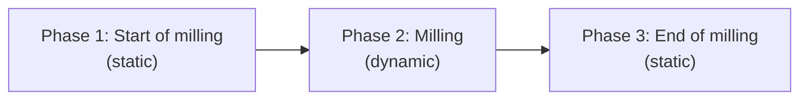

Releases on GitHub: [ATC Monitor](https://github.com/ChrisLeeThompson/ATC_Monitor/releases)

Latest version: 


This script is experimental. Many of the features are still being explored and tested.


## Introduction

ATC Monitor is a Python UI designed to read a Thermo Fisher Scientific (TFS) microscope's real-time monitor (RTM) image stream through the TFS AutoScript SDK, track how each pattern's milled area is changing, and stop patterning automatically once every pattern has met its completion criteria for a set number of consecutive confirmation rounds. It runs unattended alongside TFS AutoTEM Cryo (ATC), an application for automated cryo lamella preparation.

ATC's Rough Milling activity runs two FIB patterns as part of its Milling recipe. There are three types of FIB patterns ATC uses for Rough Milling: Rectangle, Regular Cross-section (RCS), and Cleaning Cross-section (CCS). The two most commonly used are Rectangle and Regular Cross-section. Currently, ATC Monitor reads only Rectangle patterns due to the way it monitors the RTM data.

When the patterns are complete, the script signals the Microscope Control software to stop milling, which moves ATC from the Rough Milling activity to the next activity in its template/recipe.

The script can monitor one or two patterns simultaneously (monitoring more than two is not currently supported). While designed for ATC's Rough Milling activity, it can also monitor Rectangle patterns used for manual milling or with other automated lamella preparation software. Patterns narrower than the aspect-ratio threshold are ignored, which filters out stress-relief cuts.

### Motivation

AutoTEM Cryo is quite effective in automatically milling lamellae. One area where it is less effective is knowing whether the material it is milling remains or has been sufficiently removed. 

ATC does not read RTM data (as of version 2.4.6). ATC creates patterns and runs them for a set amount of time, regardless of whether material remains or has been removed long before the total duration has been reached.

This is where ATC Monitor can help. Rough Milling activities can require a lot of time in a lamella preparation template/recipe. If we can monitor the milling process and stop it when material has been sufficiently removed, then perhaps we can reduce the total Rough Milling time by a few minutes or more. For a set of 40+ lamella sites, a few minutes saved per site adds up. 

We could also use the ATC Monitor data to adjust the parameters in the Rough Milling activity --- for example, we can quickly determine whether a recipe's depth correction needs to be increased or decreased. The monitor can be useful for optimizing ATC templates.

### Determining Pattern Completion

Determining when the milling patterns are complete is based on the idea that FIB milling (in the context of on-the-grid cryo lamella preparation) has three phases.

The first phase is somewhat static. Milling is starting and changes in the RTM data are relatively low. The second phase is dynamic. FIB milling is more rapidly removing material and RTM data is quite different from one point in time to the next. The third phase is mostly static again. The material has been removed and changes in the RTM data are again relatively low. 

Note this is based on the low FIB currents (1 nA and less) typically used to mill cryo lamellae. High FIB currents would result in rapid changes in the RTM data in the first and second phases.

While Rectangle patterns are running, the script gathers batches of images from the RTM data and compares the last image in each batch to the first. In the first phase of milling, the differences are small. In the second, dynamic phase, the differences are greater. When milling is complete or nearly complete, the differences shrink again --- this is when the script determines milling is complete.

More concretely, three criteria are evaluated for each pattern, and each can be enabled or disabled independently in its Pattern Results panel:

1. Mean Slope: the rate of change of the mean pixel value has flattened.
2. Match Score: consecutive images have stopped changing structurally.
3. Percent Pixels (or Foreground Energy, depending on the binarization method): the foreground metric has fallen to or below the Maximum Pixels threshold.

All enabled criteria must pass together for a set number of consecutive confirmation rounds (three by default) before a pattern is considered complete. When every pattern is complete, the script stops patterning.

### Challenges

Automatically determining when material has been sufficiently milled away while preparing a cryo lamella can be challenging. Observing only the mean pixel values of the entire RTM image is often not sufficient as this does not consider the "Pt bridge" phenomenon or grid bars. 

Pt bridges are often created when milling into a cell that has a Pt protective layer, such as the Pt-metalorganic layer condensed onto the sample with a gas injection system (GIS). The cellular material mills away much faster compared to the Pt, which results in a thin layer of Pt --- a bridge --- that is milled away slowly.

Grid bars are also a challenge. When they are visible within the RTM images (at low milling angles, for example), they can keep the mean pixel values relatively high and static.

ATC Monitor approaches these factors with several algorithms. When conditions have been met, it determines milling is complete. While this approach has been successful, there is a lot of room for development and improvement.

### Future Development

After many rounds of testing, milling Rectangle patterns, and watching RTM data, I have found that the next steps most likely include training a machine learning model to analyze the data.

ATC Monitor can save the images being pulled from the RTM data. It saves the raw images, the processed images, and metadata from the microscope and analysis. All of this data can be used to train a model. With sufficient classification, I think this approach could be useful, and could open the door to monitoring other pattern types, such as Regular Cross-section patterns.

## Requirements

The script's requirements differ from the standard list under [Requirements](/scripts/#requirements) on the [Scripts](/scripts/) page. The script requires:

* PySide6 6.7.1 (pinned; the worker teardown path was validated against this release)
* shiboken6 6.7.1
* Python 3.11+
* NumPy 2.2.5+
* OpenCV 4.8.1+
* Pillow 10.1+
* scikit-image 0.25.2+
* Matplotlib 3.8.1+
* [TFS AutoScript 4.14+](https://www.thermofisher.com/us/en/home/electron-microscopy/products/software-em-3d-vis/autoscript-4-software.html) --- required

All of these packages are included with the AutoScript 4.14 environment, so no additional dependencies are needed. Because this script monitors RTM data and sends commands to stop FIB patterning, it cannot run without the AutoScript environment.

## Installation

To install, follow the general steps under [Installing A Script](/scripts/#installing-a-script) on the [Scripts](/scripts/) page. Because the script interacts with a Thermo Fisher Scientific FIB-SEM microscope, it is best installed on the microscope's Support PC (SPC) and/or the Microscope PC (MPC).

## Running the Script

The script's main file is `atc_monitor.py`. See [Running A Script](/scripts/#running-a-script) on the [Scripts](/scripts/) page for how to run it with the AutoScript Python interpreter or the AutoScript Runner application.

## Getting Started



When the application is opened, it is not connected to the AutoScript Server. The status of the script's connection to the AutoScript Server is shown on the right side of the status bar at the bottom of the application window.

First, select the method for gathering images from RTM data. There are two options: Image Count and Time Interval. Image Count will gather the specified number of images into each batch for analysis. Time Interval will gather images into each batch for the specified number of seconds, calculating how many images to gather from the rate at which the RTM generates them.


    
        
    
    
        
    


Next, set the threshold values and optionally check Save Data (see [Save Data](#save-data)). The remaining processing and analysis parameters are in the Settings window (see [Settings](#settings)).

Finally, click the Start button to connect to the AutoScript Server and begin monitoring. The status of monitoring is displayed to the left of the Catbug icon.
        


### Save Data

Check the Save Data checkbox to save pattern monitoring results to a time-stamped `Saved_Data` folder in the script's root directory. This checkbox is disabled when monitoring is active.

The raw RTM images, processed images, plots, pattern results data, and some microscope metadata are saved for each monitoring session. This data may be useful for training machine learning models. See [Files the Application Writes](#files-the-application-writes) for everything the script writes to disk.

## Pattern Monitoring: An Example

To introduce some of the features in ATC Monitor, here are screenshots from monitoring two Rectangle patterns. This arrangement of patterns is typical for an ATC Rough Milling activity, and the milling was performed with a 1 nA Xe PFIB.


    
        
    
    
        
    




The pattern panels (Pattern 1 and Pattern 2) have three sections. 

The top section shows the last processed image in a batch of RTM data. Overlaid on the image is a blue rectangle. The bold side of the rectangle indicates the scan direction of the associated pattern. Click and drag an edge of the rectangle to resize it. This rectangle crops the processed image: only the area within it is analyzed and contributes to the Pattern Results. The size of the crop rectangle relative to its pattern is saved and applied to the next pattern.

The middle section shows a plot of the mean pixel value and, when available, the specimen current.

The bottom section shows the match score. The blue dashed line indicates the Match Score Threshold. Click and drag the line to adjust the threshold value (or change its value with the Match Score Threshold spinbox). The vertical green dashed line indicates the batch number when the pattern was determined to have completed.

When values in the Pattern Results panel are at or below their thresholds, they are highlighted with a green chip. When the results of both patterns have passed for the set number of consecutive confirmation rounds, the patterning is stopped.

Any parameter that remains enabled while monitoring is active may be changed. For example, changes to threshold values or crop rectangle sizes are saved and applied to the next batch of RTM images.

## Pattern Monitoring: Pt Bridge


    
        
    
    
        
    
    
        
    






This example shows a common scenario when milling into plunge-frozen cells on a grid --- the Pt bridge. Pattern 2 (the top Rectangle pattern) in the middle image above shows a bright curved feature in the middle of the pattern area. That is a Pt bridge, and it requires more milling time compared to the surrounding area.

A match score of 1.0 means there is no match between the first and last image in a batch; 0.0 means a perfect match. As the bridge was milled, parts of it moved, causing the match scores to fluctuate. 

While the slope of the mean pixel values was below the threshold value for Pattern 2, the match scores prevented the pattern from meeting criteria for three consecutive confirmation rounds.

This example shows an advantage of using more than one algorithm to analyze the RTM data to determine when to stop patterning.

## Pattern Monitoring: Grid Bar


    
        
    
    
        
    
    
        
    




This example shows a scenario where a grid bar is visible in one or both of the Rectangle patterns. In this case, a grid bar is visible in Pattern 2 (the top pattern). In most cases, grid bars are farther in the background than the lamella or region of interest.

With the typical beam currents used to mill on-the-grid lamellae, grid bars are relatively static during milling. Match scores tend to be low when milling into a grid bar and the slope of mean pixel values is also near zero.

The Foreground Energy values, or the percentage of white pixels when binarization is used (see the Binarization Method in the [Settings](#settings)), tend to remain above their threshold for patterns that mill into a grid bar. For this reason, a stall feature is included.

The stall latch is selected with the Foreground Completion Mode setting. In "Absolute + stall latch" mode (the default), the foreground criterion also completes when the foreground trace has provably floored --- dropped well below its running peak and stayed flat for a sustained window. Completions that relied on the latch are labeled `(stall)` in the results panel and recorded as `completed_via_stall` in the run metadata. Choosing "Absolute (threshold)" turns the latch off entirely.

In the example above, Pattern 2's Foreground Energy value was above its threshold (0.8), so the pattern was stopped after the stall was triggered. In this case, a grid bar was visible in the background, and patterning was automatically stopped after material near the lamella (foreground) was milled away.

## Settings


    
        
    
    
        
    
    
        
    


Click the Settings button in the main window to open the ATC Monitor Settings window. While monitoring is active, most parameters are disabled; only the Contrast/Brightness Calibration parameters can still be edited.

Every parameter has a tooltip in the application, so rather than repeating them here, this is what each group of settings controls:

* Monitoring --- timing guards for a run: how long to wait before acquiring RTM images for analysis, and the drop in mean pixel value that must be seen before results are evaluated for stopping (so evaluation does not begin until milling is clearly underway).
* Image Processing --- how each RTM image is prepared and how the foreground is isolated for the Percent Pixels/Foreground Energy metric: Gaussian blur, dilation, the Binarization Method and its related parameters, and the Foreground Completion Mode with its stall-latch settings (see [Pattern Monitoring: Grid Bar](#pattern-monitoring-grid-bar)).
* Image Analysis --- how the slopes of the mean pixel values and match scores are calculated (Gradient or Linear Regression, and over how many points), plus the aspect-ratio threshold that keeps monitoring idle for narrow patterns such as stress-relief cuts.
* Pattern Matching --- the sub-region grid used for analysis: the cropped RTM area is divided into tiles, mean pixel values and match scores are calculated per tile, and the highest values drive the results. To reduce sensitivity, increase the target tile size and reduce the minimum number of sub-regions.
* Contrast/Brightness Calibration --- automatic detector contrast/brightness balancing: whether it runs, how often, its brightness and dynamic-range targets, clipping limits, and measurement budget.

With Auto-Calibrate on Start enabled, the script calibrates detector contrast and brightness once at the start of a run, aiming for a target median brightness and dynamic range while keeping clipping within the set limits. The measured response of each detector is cached in `logs\cb_plant.json` and reused to speed up later runs. The file is created automatically, is keyed by system name so several microscopes can share one deployment, and can be deleted safely.

## Files the Application Writes

All paths are relative to the script's root directory unless shown otherwise.

| Path | Contents | Growth |
| --- | --- | --- |
| `logs\atc_monitor.log` | Main application log, one line per event. | Rotating, 5 MB × 5 files. |
| `logs\faulthandler.log` | Crash and diagnostic record, copied here at startup from the local per-user copy. | Rotates to `.1` at 5 MB. |
| `%LOCALAPPDATA%\ATC_Monitor\logs\faulthandler.log` | The live crash record, kept on local disk so a crash is never lost to a network share. | Swept and reset at each launch. |
| `Saved_Data\Run-N_<timestamp>\` | Images, per-batch metrics, plots, and run metadata. Written only when Save Data is checked. | One directory per run; delete when no longer needed. |
| `logs\cb_plant.json` | Learned detector response, keyed by system name. | A few hundred bytes. |

If the script directory is not writable, the script falls back to `%LOCALAPPDATA%` for its logs and reports where they went in the log's first lines. Log retention is automatic; only `Saved_Data` grows without limit.

The first line of `logs\atc_monitor.log` records the running version, for example `LAUNCH app=3.4.4`. Check it after updating to confirm the version you intended is the one running.